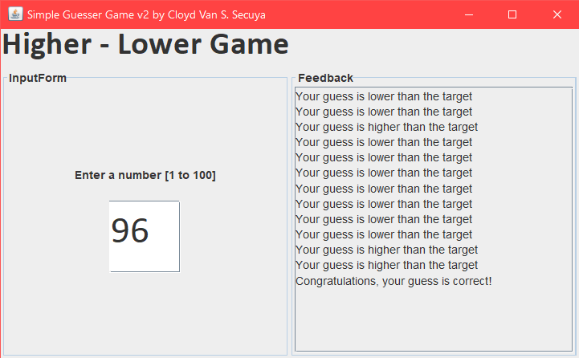

# Simple Guesser Game v2

<h3 align="center">A game by: Cloyd Van Secuya</h3?> 

 

Made possible with:

 

# Features
1. A simple and clean user interface
2. Simple and easy to use!
3. A scollpane for user feedback 
4. Event driven application
5. Lightweight app

<i>Start challenging yourself with this guessing game where you are presented with a goal of guessing the right number.</i>
 
<i>Do you need to see a feed back on how you do with the guessing algorithm? Then, I just have the right scroll pane for that!</i>